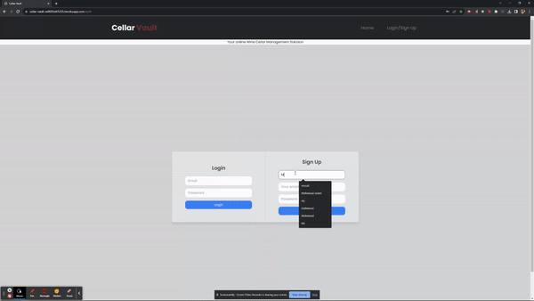
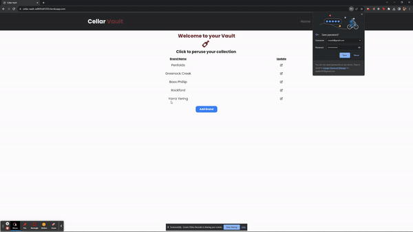
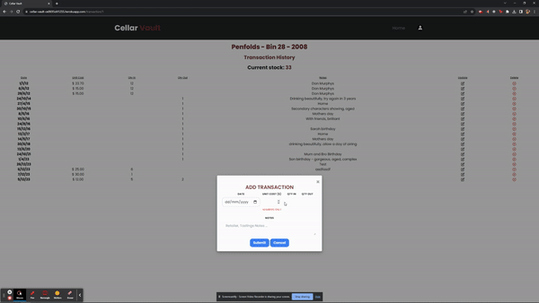
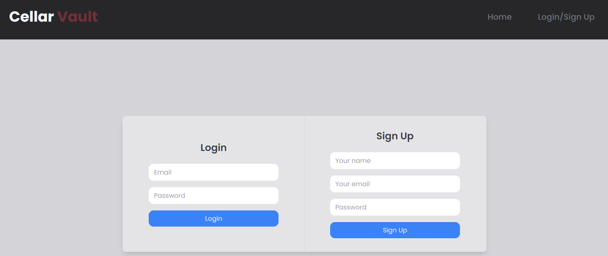
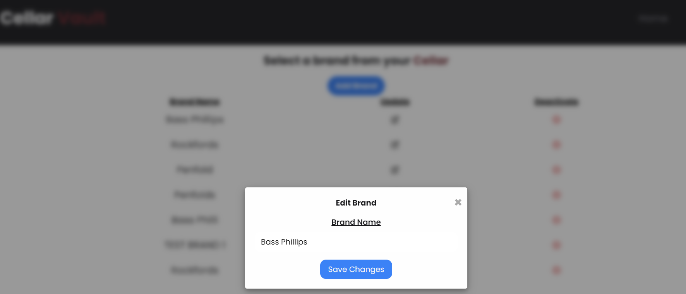

# cellar-vault

# Cellar Vault

## Table of Contents

- [Description](#description)
- [Installation](#installation)
- [Usage](#usage)
- [Screenshots](#screenshots)
- [License](#license)
- [Contributing](#contributing)
- [Testing](#testing)
- [Technologies Used](#technologies-used)
- [Contributors](#contributors)

## Description

Cellar Vault simplifies wine collection management by offering the following features:

- **User-Friendly Dashboard:** Access your wine collection and vintage details through an intuitive and visually appealing dashboard.

- **Wine and Vintage Management:** Add, update, or delete wines and their associated vintages effortlessly.

- **Transaction Tracking:** Keep records of wine transactions, including purchases, sales, and consumption, for accurate inventory management.

- **Flexible Vintage Details:** Store information about each vintage, such as the vintage year, format, and drink-by date.

- **Interactive User Interface:** Navigate through your collection, update wine details, and explore transactions with ease.

#### Bonus features

In addition to the core functionality, "Cellar Vault" offers the following optional features:

- Email Notifications: Receive personalized email notifications upon signing in to Cellar Vault. Get a warm welcome message and

(<a href="#readme-top">back to top</a>)

## Screenshots

### Live Screenshots

### Screenshots

Screenshot of the application during "Login/signup"

- Note the headings rendered with colour schemes used
- Note formatting and use of icons and colours across the application

Screenshot of the application during "Interaction with Edit Form"

(<a href="#readme-top">back to top</a>)

Cellar Vault is a deployed solution hosted on Heroku. Installation isn't required for end user consumption.

If you wish to clone or fork the repo and contribute, follow the steps below:

## Installation

1. Clone or fork the repository to your local machine

2. Open your terminal or command prompt and navigate to the project's root directory.

3. Run the following command to install the necessary npm packages:

   `npm install`

4. This will install the required dependencies, including Node.js, Express.js, Sequelize, and more.

5. After the npm packages have been successfully installed, you need to set up your MySQL database for the application to read and write to

6. Log into MySQL using the following command (replace root with your MySQL username if it's different):

   `mysql -u root -p your-password`

7. Once you are logged into MySQL, create the database with the provided schema by running the following command from the project's root folder (ensure you are at the root folder):

   `source ./db/schema.sql`

8. After executing the schema.sql script, exit MySQL by running:

   `Quit`

9. You can now run the "Cellar Vault" application. Start the server by running the following command:

   `npm start`

10. Or use the development server with automatic reloading:

    `npm run dev`

11. Your "Cellar Vault" application should now be up and running. You can access it by opening a web browser and navigating to the appropriate URL (typically http://localhost:3001).

These installation steps cover the setup of your application and its dependencies, allowing you to run "Cellar Vault" locally on your machine.

(<a href="#readme-top">back to top</a>)

## Contributing

We welcome contributions to improve Cellar Vault! To contribute to this project, please follow these steps:

1. Fork this repository.

2. Create a new branch for your feature or bug fix: `git checkout -b feature-name`

3. Make your changes and commit them: `git commit -m "Your commit message here"`

4. Push your changes to your forked repository: `git push origin feature-name`

5. Open a pull request to the main repository.

6. Provide a detailed description of your changes and why they are valuable.

Our team will review your pull request and merge it if it aligns with the project's goals and quality standards. Thank you for contributing!

If you have any questions or need assistance with your contribution, please feel free to contact [Hy](https://github.com/hybee234), [MJ](https://github.com/alghaibb) or [Khoi](https://github.com/knguyen3531)

We expect all contributors to adhere to our [Code of Conduct](CODE_OF_CONDUCT.md). Please read it to understand our community standards.

### Reporting Issues

If you encounter any issues or bugs while using Cellar Vault, please [open an issue](https://github.com/hybee234/cellar-vault/issues) on our GitHub repository. Provide as much detail as possible, including steps to reproduce the problem.

(<a href="#readme-top">back to top</a>)

## Usage

To start using Cellar Vault, follow these basic usage instructions:

1. Visit the [website](https://cellar-vault-ce0695d41255.herokuapp.com/).

2. Create an account or log in if you already have one.

3. Once logged in, you'll be directed to the dashboard, where you can manage your wine collection.

4. Add wines to your collection by providing details such as wine name.

5. For each wine, add multiple vintages with information like vintage year, format, and drink-by date.

6. Record wine transactions, including purchases, sales, and consumption.

7. Explore your wine collection and easily update wine and vintage details as needed.

8. Log out of your account when you're finished.

(<a href="#readme-top">back to top</a>)

## Technologies Used

- **Node.js**: Runtime environment for executing server-side JavaScript code.
- **Express**: Web application framework for building RESTful APIs.
- **Express-Handlebars**: Template engine for rendering HTML templates.
- **Express-Session**: Middleware for managing user sessions.
- **MySQL2**: MySQL database driver for Node.js.
- **Sequelize**: Promise-based ORM for interacting with databases.
- **Bcrypt**: Library for securely hashing passwords.
- **Dotenv**: Utility for loading environment variables.
- **Nodemailer**: Library for sending email notifications.
- **Tailwind CSS**: Utility-first CSS framework for styling the application's frontend.

**Development Tools**:

- **Nodemon**: Development tool for auto-reloading the server during development.

(<a href="#readme-top">back to top</a>)

## Testing

Automated Test scripts have not been developed for this application

(<a href="#readme-top">back to top</a>)

## Contributors

- [hybee234](https://github.com/hybee234)
- [knguyen3531](https://github.com/knguyen3531)
- [alghaibb](https://github.com/alghaibb)

(<a href="#readme-top">back to top</a>)

## License

This application can be used in conjunction with licensing covered in <b>MIT Lcensee</b>

(Click on the badge for details of the license)

(<a href="#readme-top">back to top</a>)

